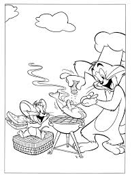

# Tom and Jerry  BBQ fighting

Tom is busy preparing a barbecue outside, grilling some food for himself, when Jerry, as always, sneaks into the scene. Jerry sees a delicious spread of food — especially a juicy piece of meat or a hot dog — and decides to make a move.

The chase begins with Tom trying to catch Jerry, but Jerry cleverly uses the BBQ grill as an obstacle. He darts between the grill, the coals, and various pieces of food, creating mayhem in the process. At one point, Jerry manages to grab a hot dog or a piece of sausage from the grill, and Tom, furious, tries to snatch it back.

In the midst of this hilarious battle, Tom might end up getting his own face burned by the grill or accidentally knocking over the condiments, turning the whole BBQ area into a mess. At one point, Jerry might use a fork or spatula to launch food items like sausages, hamburgers, or even whole pies at Tom. In return, Tom might try to use the grill itself, or even a large piece of BBQ equipment, to trap Jerry — but always to no avail.

Eventually, their antics escalate into a full-on food fight, with Tom and Jerry tossing food at each other

